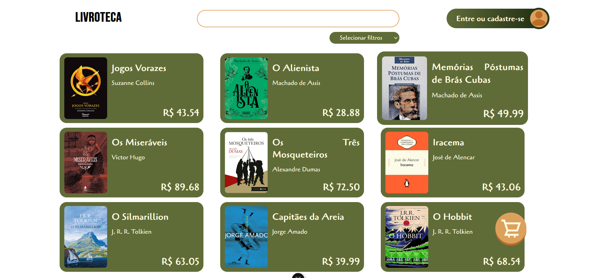
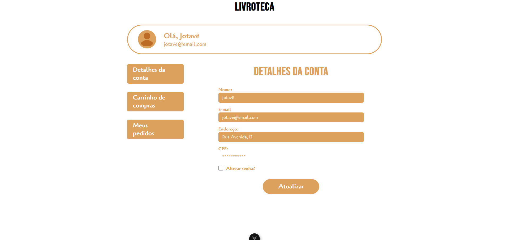

# Gerenciador virtual de livraria (Livroteca)

Este projeto foi desenvolvido durante a disciplina de Banco de Dados I, na Universidade Federal da Paraíba (UFPB), com o objetivo de demonstrar o domínio das ferramentas básicas de modelagem de bancos de dados e da linguagem SQL. Para isso, foi criado um sistema de compra e venda em uma livraria virtual, no qual é possível cadastrar livros, gerenciar usuários (compradores e vendedores) e registrar transações de compra e venda.

A aplicação foi construída com NestJS (no backend) e Vue.js (no frontend), utilizando o PostgreSQL como Sistema Gerenciador de Banco de Dados (SGBD).
O foco do projeto está no treinamento de modelagem relacional, consultas SQL e na integração entre API REST e banco de dados, em um ambiente web completo e funcional.

## Autores

Esse projeto foi desenvolvido por [Davi de Lacerda Teixeira](https://github.com/DavideLacerdaT) e [João Victor Fernandes da Silveira](https://github.com/oiotave)

## Tecnologias utilizadas

## Telas principais

### 1. Tela principal

Permite a visualização dos livros em estoque e a seleção de livros para compra, bem como acesso à barra de pesquisa e/ou carrinho de compra.

  

### 2. Tela de conta do usuário

Permite a visualização de informações pessoais da conta do usuário, bem como acesso a pedidos já feitos e o carrinho de compras atual.

  

